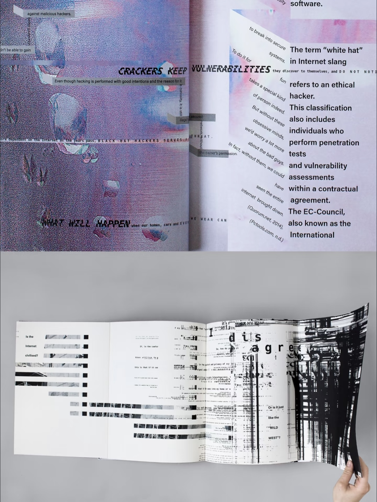
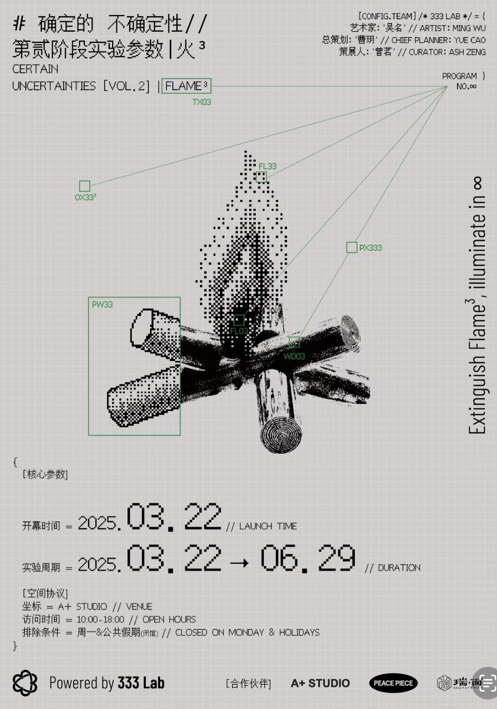
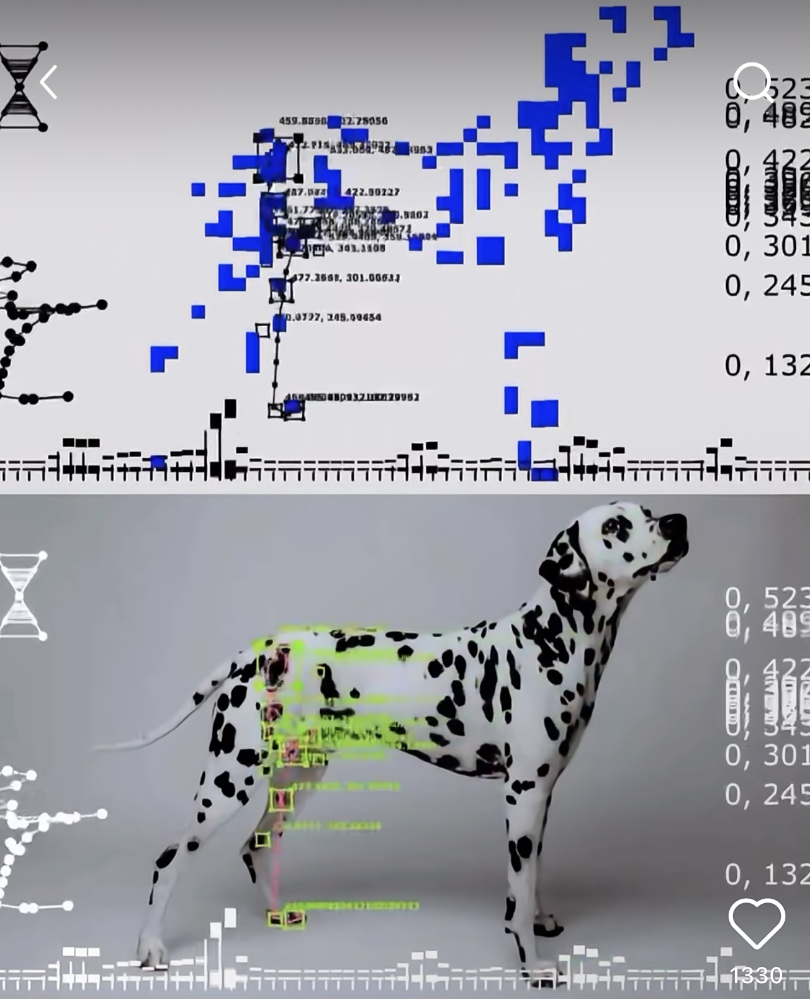
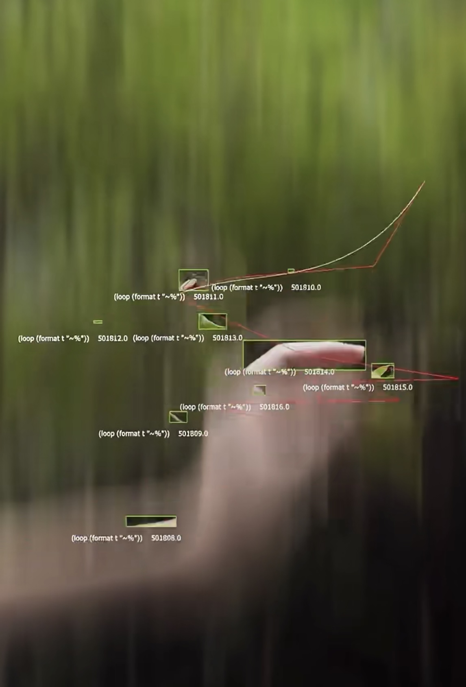

# xzha0076_9103_tut9

# Quiz 8

## Part 1: Imaging Technique Inspiration

I want to use abstract shapes to represent the forms of objects, using squares of different sizes to outline their overall shape, along with slight dynamic changes in the shapes. The user will upload an object photo with no background. I also plan to use lines and boxes to show the relationships between objects, such as distance and distribution. These lines and boxes will change dynamically based on the movement of the mouse.

### Inspirations

## Part 2: Coding Technique Exploration

I can use a coding technique like TouchDesigner.  
Key functional nodes are as follows:  
- **Copy SOP**: Duplicates multiple rectangles based on the extracted contour data to create a layout of squares in different sizes.  
- **Script CHOP**: Uses Python scripts to calculate the distances between squares and dynamically create connection lines.  
- **Mouse In CHOP**: Captures the mouse position to enable interaction with the lines and boxes.  
- **Feedback TOP**: Creates slight dynamic changes in the graphics to enhance the visual effect.  

### Example artworks

- [http://xhslink.com/a/UzbTSJSjkW0bb](http://xhslink.com/a/UzbTSJSjkW0bb)

- [http://xhslink.com/a/DF2GpbskI50bb](http://xhslink.com/a/DF2GpbskI50bb)

---

